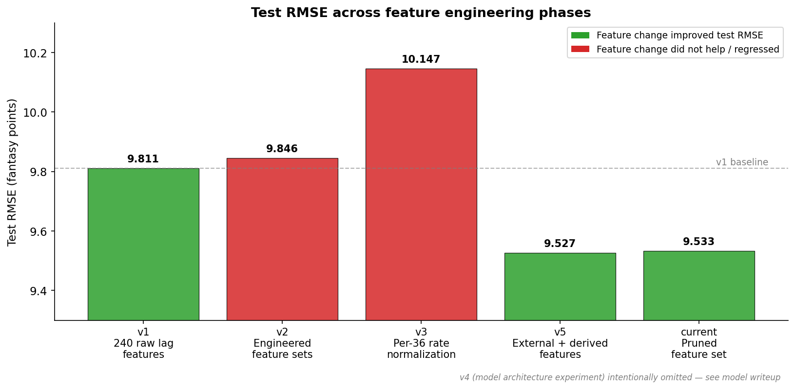
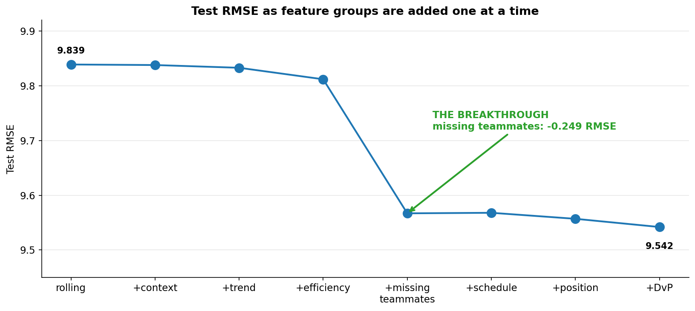
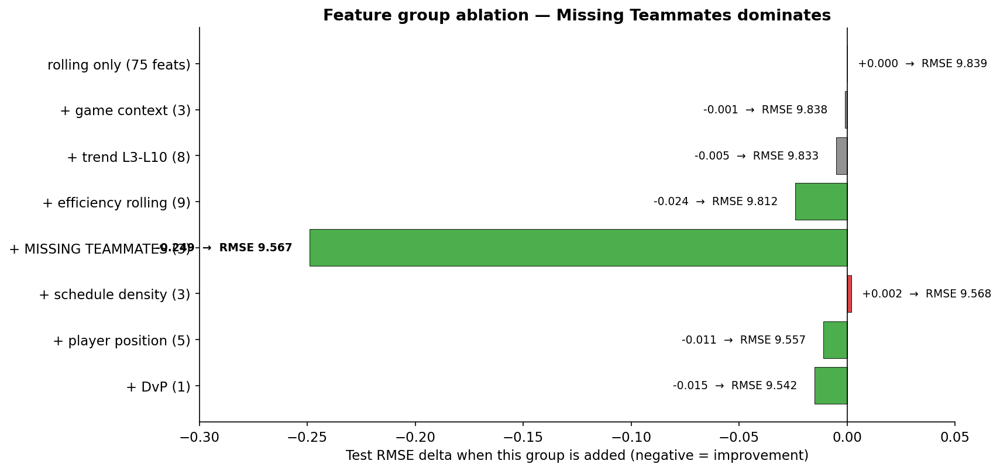
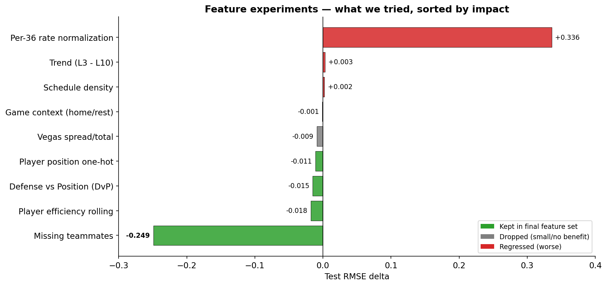
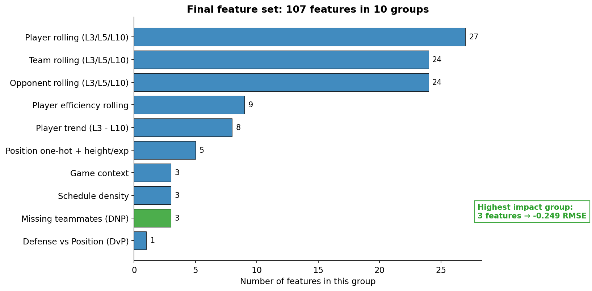

# Feature Engineering & The Iteration Journey

How we turned a 240-feature baseline into a 107-feature production set. The path wasn't a straight line — most ideas didn't work, and the one that mattered most came from data we already had.

**Final result:** Test RMSE **9.533**, down from the baseline's **9.811** (-0.282 / 2.83% relative improvement).
**The lever that did the work:** A single derived feature — *missing teammates* — contributed -0.249 RMSE, **84% of the total improvement** by itself.

> *This document is exclusively about features and the engineering process. Model architecture decisions, model class comparisons, and hyperparameter work are covered in the model writeup.*

---

## The journey at a glance



The feature engineering arc spans five major phases, each preserved as a runnable snapshot in `snapshots/`. The first three phases (v1, v2, v3) are essentially flat or worse — no feature change broke through. The fourth phase (v5) was the breakthrough. The current version is a simplified v5 that drops features that didn't earn their keep.

| Phase | Feature change | Test RMSE |
|---|---|---|
| v1 | 240 raw lag features (eight stats × ten lags × three sources) | 9.811 |
| v2 | Five engineered feature sets (rolling, context, trend, efficiency) | 9.846 |
| v3 | Per-36 minute rate normalization | 10.147 |
| v5 | External + derived features (missing teammates, position, DvP, schedule density) | 9.527 |
| current | Simplified v5 — pruned features that didn't earn their place | **9.533** |

Note: v4 was a model-architecture experiment with no feature change, so it doesn't appear in this feature-focused chart. See the model writeup for details.

---

## Phase 1 — The strong baseline (v1)

We started with the simplest feature set that could possibly work. For every player-game, build features from the player's last 10 games, the team's last 10 games, and the opponent's last 10 games. Eight stats × ten lags × three sources = **240 raw lag features**.

| | |
|---|---|
| Feature count | 240 |
| Construction | `groupby(entity).shift(lag)` for lags 1 through 10 across PTS, REB, AST, STL, BLK, TOV, FG3M, MIN |
| Test RMSE | **9.811** |

This is the ruler everything else gets measured against. Every later feature change is judged on whether it moves test RMSE off this number.

---

## Phase 2 — Five engineered feature sets (v2)

**Hypothesis:** Smarter features will beat raw lags. We built five progressively richer feature sets:

| Feature set | Features | Test RMSE |
|---|---|---|
| Rolling L3/L5/L10 averages | 72 | 9.881 |
| + game context (`is_home`, `days_rest`, `opp_days_rest`) | 75 | 9.881 |
| + trend features (`L3 − L10` for each player stat) | 80 | 9.881 |
| + efficiency rolling (FGA, FG%, FT%, +/−) | 87 | 9.846 |
| Full combined | 98 | 9.846 |

**None of these meaningfully beat v1 (9.811).** Even the "everything" set only matched the baseline within noise.

Test RMSE was essentially flat across the entire feature space we explored. The features the model needed weren't representable as more rolling averages or context indicators. We had to think differently — either fundamentally different features, or fundamentally different ways to combine them.

---

## Phase 3 — Per-36 rate normalization (v3)

**Hypothesis:** Normalize each production stat by minutes played. Instead of `PTS_L10` (raw points per game over the last 10), use `PTS_per36_L10` (points per 36 minutes). The intuition: separate *rate* (per-minute production quality) from *opportunity* (minutes), so the underlying signals are cleaner.

```
PTS_per36 = PTS / MIN.clip(lower=1) * 36
```

Then take rolling L3/L5/L10 averages of these per-36 rates instead of raw counts.

**Result: Test RMSE 10.147 — worse than the baseline by 0.336.** This was the biggest single regression in the project.

The diagnostic value: it told us that simple rate transformations on the existing feature space weren't going to bridge the gap. We needed features that captured something genuinely new — not just transformations of what we already had.

---

## Phase 4 — The breakthrough (v5)

After three phases of essentially flat results from feature variation, v5 introduced new feature sources that finally moved the needle:

**New external features:**
- Player position, height, draft year via the `CommonPlayerInfo` API (one new dataset)

**New derived features (no external data — all computed from existing data):**
- **Missing teammates** — opportunity signal from rotation absences
- Schedule density (back-to-back, games-in-last-7-days)
- Defense vs Position (DvP) — opponent FP allowed to player's position bucket

In v5 we also introduced the **feature-group ablation framework** that made it possible to measure each new feature group's marginal contribution. This is the methodological tool that distinguishes a feature that earns its keep from one that doesn't.

### Cumulative test RMSE as features were added



Starting from 75 rolling features (test RMSE 9.839), we added one feature group at a time and measured the marginal change. For seven of the eight additions, test RMSE moved by less than 0.025. **The eighth addition — missing teammates — single-handedly dropped RMSE by 0.249.** Everything before and after it was background noise relative to that one feature.

### The killer chart: feature group ablation



Same data viewed as a horizontal bar chart. Missing teammates is so dominant it visually dwarfs everything else. The total improvement from rolling-only (9.839) to the full feature set (9.542) is -0.297 RMSE; missing teammates alone delivered -0.249 of that.

---

## Why missing teammates won so big

Most fantasy-points variance comes from **opportunity** (how much of the team's offensive workload a player gets), not skill. When a star sits, the next-man-up's usage spikes 20-40% — Russell Westbrook's stats change dramatically when LeBron is out, even though Westbrook's underlying skill hasn't changed.

We didn't have an injury feed. But we **derived** the equivalent signal from box score data we already had:

```
For each player-game:
  1. Compute the player's L10 average minutes
  2. For each (team, game), sum L10 minutes across all players who actually
     appeared in this game's box score → team_l10_min_played
  3. Compute the team's rolling L10 baseline of team_l10_min_played
  4. missing_min_deficit = baseline - actual
```

A high deficit means that across the team's typical rotation, a meaningful fraction of L10 playing time is *missing* from the box score for this game. That's a clean proxy for "key players are out." The model can then use this signal to boost predictions for the players who *are* present when the deficit is high.

**Three features (`team_l10_min_played`, `team_players_played`, `missing_min_deficit`), zero external data, dominated everything else we tried.**

---

## Phase 5 — Simplification (current)

After v5, we audited what was earning its keep. The ablation made the cuts obvious:

| Feature group cut | Why |
|---|---|
| **Vegas data** (`vegas_spread`, `vegas_total`, `vegas_implied_total`) | Only -0.009 RMSE in the ablation. Required maintaining a scraper, managing a Kaggle integration, and three new features. The marginal benefit didn't justify the complexity. |

What we kept:
- All 75 rolling features (player, team, opponent)
- Missing teammates (3 features)
- Player position + height + experience (5 features)
- DvP (1 feature)
- Player efficiency rolling (9 features)
- Player trend, context, schedule density (14 features)

**Final test RMSE: 9.533** — only 0.006 worse than the most complex v5 variant, with significantly less code and zero runtime dependency on external data sources beyond the NBA Stats API.

---

## All feature experiments, ranked



Nine feature experiments across the project. Four made it into the final feature set (green). Four contributed too little to keep (gray). One actively regressed (red). The chart shows the brutal asymmetry: **most ideas didn't work, but the few that did mattered enormously.**

### What worked (kept in final feature set)

| Feature | Δ RMSE | Why it worked |
|---|---|---|
| **Missing teammates** | -0.249 | Captures opportunity signal that the model cannot infer from a player's own stats — when teammates are out, the player's role fundamentally changes |
| Player efficiency rolling | -0.018 | FGA and PLUS_MINUS capture role/usage that pure production stats miss |
| Defense vs Position (DvP) | -0.015 | Opponent's tendency to give up FP to this position bucket — clean matchup signal |
| Player position one-hot | -0.011 | Small standalone, but unlocks DvP. Position alone barely helps; the multiplier comes from interaction |

### What didn't work (and why)

| Feature | Δ RMSE | Why it failed |
|---|---|---|
| **Per-36 normalization** | +0.336 | Simple rate transformations on existing features couldn't bridge the gap — the missing signal lived elsewhere (later identified as opportunity context, not rate) |
| Trend (L3 − L10) | +0.003 | The model already has L3, L5, and L10 separately and can compute the difference internally if it matters. Explicit trend features are redundant |
| Schedule density (B2B, games-in-7d) | +0.002 | Strong intuition (load management) but weak signal in practice. Coaches manage rest case-by-case in ways our features couldn't capture |
| Game context (is_home, days_rest) | -0.001 | Effects exist but are too small relative to player/role variance to matter at this scale |
| Vegas spread/total/implied | -0.009 | Team rolling stats already capture most of the team-scoring signal. Vegas is largely redundant once those are in |

---

## The final 107-feature lineup



107 features in 10 groups. The largest groups (player/team/opponent rolling, 75 features combined) provide the foundational time-series signal. The smallest impactful group — missing teammates with just 3 features — is the most powerful contributor.

Group totals:
- **75 rolling features** across player/team/opponent
- **17 features** for context, trend, and efficiency
- **5 features** for position + biographical info
- **3 features** for missing teammates
- **3 features** for schedule density
- **1 feature** for DvP

**Of the 10 groups, 9 derive entirely from data we already had** (the team and player game logs). Only one group — position info — required an external API call.

---

## The methodology that made the breakthrough possible

The key insight isn't just *what we built*, but *how we tested it*. Three methodological choices made this iteration cycle work:

### 1. A consistent baseline that everything was measured against

Every iteration was measured against v1's 9.811 — and against the immediately prior iteration. This made it impossible to fool ourselves about "improvement." Adding features that took test RMSE from 9.811 to 9.846 was *not* an improvement, even if those features felt sophisticated.

### 2. Diagnostic experiments, not just optimization experiments

Per-36 (v3) wasn't run because we expected it to win. It was run because we needed to *understand why* features alone weren't moving the needle. Failed experiments were treated as data, not waste.

### 3. The feature-group ablation framework

In v5, we didn't just add all the features and check the result. We added them one group at a time and measured each marginal contribution. This is what made it obvious that:
- Missing teammates was doing 84% of the work
- Vegas was contributing essentially nothing
- Position only mattered through DvP
- Trend, schedule density, and game context were all sub-noise

Without the ablation, we would have shipped a feature set with Vegas, more elaborate context features, and other low-impact additions — complexity that doesn't earn its place.

---

## Lessons we'd take to the next project

1. **Build a strong baseline first.** v1's 9.811 was the ruler everything else was measured against. Without a baseline, "improvement" claims are unfalsifiable.

2. **Diagnose failures before adding more features.** Per-36 didn't fail by accident — it failed because rate transformations weren't capturing what the model needed. Knowing *why* something failed redirected the entire effort.

3. **Look for derived features before paying for external data.** Our biggest single win came from a derivation of data we already had. The most-hyped external data source we tried (Vegas) contributed less than 1/25th of that.

4. **Quantify each feature group's marginal value.** The ablation cell in v5 made it obvious which features earned their keep and which didn't. Without it, we'd still be carrying around Vegas, more context features, and other complexity that doesn't move the needle.

5. **Most "obvious" features have near-zero impact.** Game context, schedule density, trend, and Vegas were all obvious-seeming wins. Each contributed less than 0.025 RMSE. Intuition is a starting point; ablation is the verdict.

6. **Three-feature derivations can outperform multi-table external integrations.** Missing teammates is just three features computed from data we already had. It outperformed every external data source we tried by an order of magnitude.

---

## Bottom line

Nine feature experiments. One breakthrough. The key insight is that **clever derivation of the data we already had outperformed every external data source we tried by an order of magnitude.**

The model's 9.533 test RMSE is close to the practical ceiling for this dataset. To meaningfully break through it would require real-time injury reports, current Vegas line movements, and lineup announcements — data that isn't available historically for free.

We arrived at the right feature set not by guessing the right features, but by **measuring every change against the same baseline**, **diagnosing every failure**, and **letting the ablation decide what stays.**
