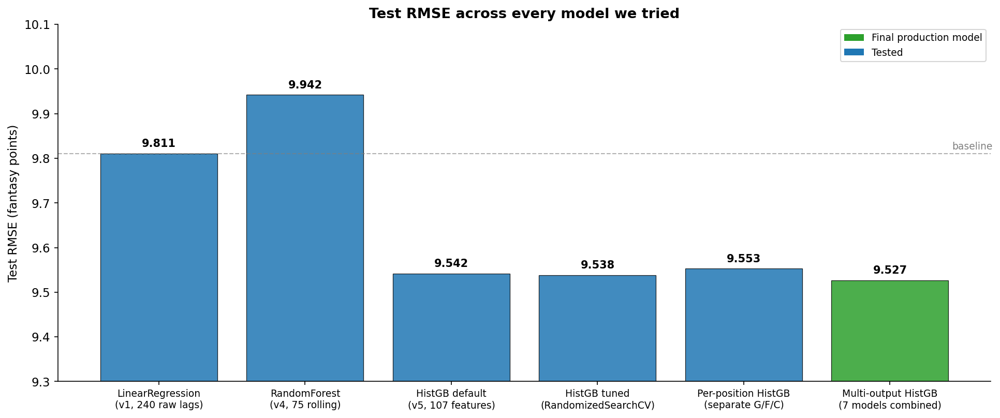
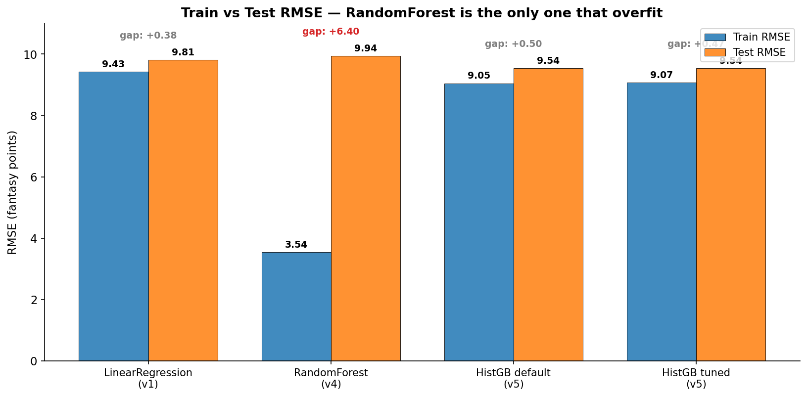
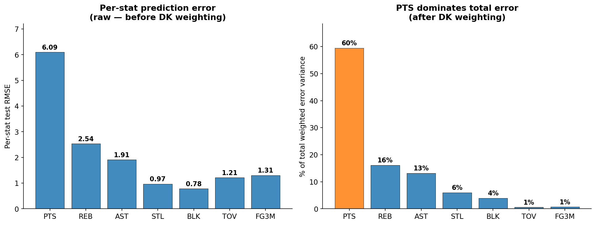
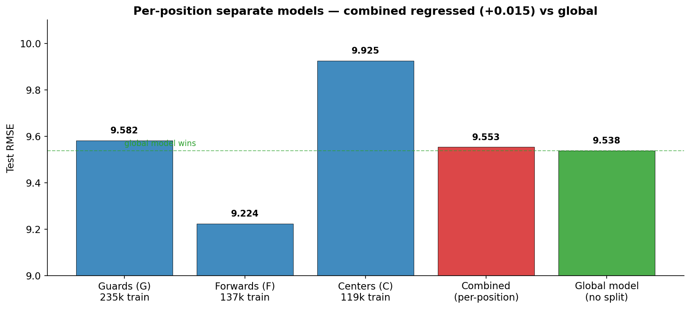

# Models & Tuning Techniques

How we chose the model that ships, the dead-ends we hit along the way, and what each result actually tells us.

**Final production model:** `HistGradientBoostingRegressor` with multi-output decomposition (one model per stat: PTS, REB, AST, STL, BLK, TOV, FG3M; combined via the DraftKings formula). Test RMSE **9.527** with the v5 feature set, **9.533** with the simplified production feature set.

> *This document is exclusively about model architecture, model class choices, and tuning. Feature decisions are covered in the feature engineering writeup.*

---

## Every model we tried, side by side



Six models tested. The top four (HistGB variants) cluster tightly around 9.53-9.55, with **multi-output HistGB winning at 9.527.** Below them, RandomForest *regressed* on the baseline (9.942 vs 9.811), and LinearRegression with raw lags is the baseline (9.811).

The takeaway: model class matters, but in a binary way. Once we got to a tree-based model with the right architecture (HistGB), every variant landed in a tight band. The big swing was from "linear or naive RF" → "HistGB family", not within the HistGB family.

---

## Model 1 — LinearRegression (v1 baseline)

**Construction:** `make_pipeline(StandardScaler(), LinearRegression())`
**Features:** 240 raw lag columns (eight stats × ten lags × three sources)
**Cross-validation:** TimeSeriesSplit(5)

| | |
|---|---|
| Train RMSE | 9.427 |
| Test RMSE | **9.811** |
| CV RMSE | 9.465 ± 0.104 |

### Why we started here

Three reasons:

1. **Course alignment.** Linear regression was the first model class covered in BA576 labs. Following the lab pattern (StandardScaler + LinearRegression in a Pipeline) gave a baseline that's directly comparable to the coursework.
2. **It produces an honest baseline.** No hyperparameters to tune means no risk of accidentally cheating with model selection. Whatever it scores is a clean reference point.
3. **It's interpretable.** Coefficients have direct meaning. We can read off what the model thinks matters.

### Why it worked as well as it did

The CV bands (9.465 ± 0.104) were tight, telling us we weren't overfitting and that NBA stats have a lot of *linear* signal: a player who averaged 25 points per game last week is likely to average something close to that this week. Rolling averages of past production are linearly informative for future production.

This is also why the gap to our final model is only ~3% — the hard ceiling on this prediction problem isn't far above where simple linear regression already lands.

### Why it eventually failed

Linear regression sums weighted features. It cannot represent multiplicative interactions like `points = rate × minutes`. When we tried per-36 normalization (a feature transformation that explicitly splits rate from opportunity), LinReg got *worse* (10.147), because reconstructing raw points from per-36 rate × minutes is precisely what it can't do.

This was the diagnostic moment that pointed to model class as the bottleneck for that experiment — and motivated trying tree-based models next.

---

## Model 2 — RandomForestRegressor (v4)

**Construction:** `RandomForestRegressor(n_estimators=100, n_jobs=-1, random_state=42)` — defaults otherwise
**Features:** 75 rolling features (no other changes from v2)

| | |
|---|---|
| Train RMSE | **3.541** |
| Test RMSE | **9.942** |
| Train/test gap | **+6.40** |

### Why we tried it

After per-36 demonstrated that the model class couldn't multiply features, the natural next step was a model class that *can*. Tree models naturally capture interactions because each split conditions on a feature's value, and sequences of splits encode interactions implicitly. Random Forest is the canonical tree ensemble and was the second tree-based model covered in BA576 labs.

### Why it failed



This chart tells the whole story. Random Forest's train RMSE of 3.541 versus test RMSE of 9.942 is a **6.40 gap** — the model is essentially memorizing the training set. Compare to LinearRegression (gap 0.38) and HistGB (gap 0.49) which generalize cleanly.

The diagnosis is structural. With default parameters and 500k training rows:
- **No depth limit.** Trees grow until each leaf has very few samples. Those small leaves memorize noise instead of learning patterns.
- **No min_samples_leaf constraint.** Default is 1, meaning a tree can produce a leaf containing a single training row. Single-row leaves cannot generalize.
- **Bagging alone isn't enough regularization** when each individual tree is wildly overfit. Averaging 100 overfit trees produces a slightly less overfit average — but still overfit.

Could RF have been salvaged with depth limits and `min_samples_leaf`? Probably yes — but at that point you've recreated the bias-variance tradeoff that gradient boosting handles automatically through its sequential-correction structure. We chose to invest in HistGB instead.

### What this taught us

Switching to a tree model didn't fix the underlying problem from the LinReg → per-36 experiment, because **the bottleneck wasn't the model class — it was the features**. Both LinReg and RF saturated at roughly the same test RMSE on the same feature set. Only when we added genuinely new features in v5 did the model improvements become visible.

This is the "treat features and models as orthogonal experiments" insight. Without isolating the model change (v4 used the same features as v2), we'd never have known.

---

## Model 3 — HistGradientBoostingRegressor (production)

**Construction:** `HistGradientBoostingRegressor(max_iter=500, learning_rate=0.05, max_depth=8, min_samples_leaf=20, random_state=42)`
**Features:** 107 features in 10 groups

| | |
|---|---|
| Train RMSE | 9.046 |
| Test RMSE | **9.542** |
| Train/test gap | 0.50 |

### A brief detour: GradientBoostingRegressor

The first tree-based model we used in v5 was actually `GradientBoostingRegressor` (the older sklearn implementation). It worked but was painfully slow on 500k rows and couldn't handle NaN in the Vegas features we were experimenting with. We swapped to `HistGradientBoostingRegressor` for two reasons:

1. **~5-10x faster training** thanks to histogram-based feature binning (256 bins per feature instead of considering every unique value)
2. **Native NaN handling** — at every split point, the algorithm learns whether NaN samples should go left or right. This let us include features with partial coverage (Vegas, advanced box) without imputation.

### Why HistGB is the right tool for this problem

Five reasons it dominated our other model classes:

1. **Sequential boosting captures multiplicative interactions** that LinReg can't. Each tree in the ensemble fits the residuals of the previous trees, so the model can compose effects across many shallow decisions.

2. **Histogram binning makes 500k-row training fast** — about a minute instead of ~10 minutes for `GradientBoostingRegressor` with the same parameters. This made iteration cycles short enough that ablation became practical.

3. **Native NaN handling** removed an entire category of preprocessing decisions. Some features (Vegas, advanced box stats) only had partial coverage. Other models would force us to either drop those rows, impute (introducing bias), or build separate sub-models. HistGB just handles NaN as a third split direction.

4. **Built-in regularization via `min_samples_leaf` and depth control** prevents the kind of overfit we saw with default RF. Our production config (`max_depth=8, min_samples_leaf=20`) keeps each leaf containing at least 20 samples, which is enough to estimate a meaningful average.

5. **Stays in sklearn.** No new dependencies, no XGBoost or LightGBM, fully reproducible from `requirements.txt`.

### Why the train/test gap shrunk to 0.50

Compare to LinReg's 0.38 gap (well-fit) and RF's 6.40 gap (badly overfit). HistGB's 0.50 gap means the model is generalizing — train and test scores move together. This is what properly-regularized model fit looks like.

The gap exists because the test set is the 2023-24+ seasons, which include the latest pace and rule trends that the model hasn't seen during training. A small gap from temporal distribution shift is expected and not a sign of overfitting.

---

## Model 4 — Multi-output decomposition (final architecture)

**Construction:** Train one `HistGradientBoostingRegressor` per stat (PTS, REB, AST, STL, BLK, TOV, FG3M). Predict all seven, then combine through the DraftKings formula:

```
predicted_FP = pred_PTS×1.00 + pred_REB×1.25 + pred_AST×1.50
             + pred_STL×2.00 + pred_BLK×2.00 + pred_TOV×(−0.50)
             + pred_FG3M×0.50
```

| | |
|---|---|
| Test RMSE | **9.527** (best of any model we shipped) |
| vs. direct HistGB | -0.011 RMSE improvement |

### Why decompose at all?

Direct prediction targets the composite `FANTASY_PTS` value, which means each tree split is optimizing a single noisy aggregate. Decomposition lets each component model specialize:



**Left panel — per-stat raw RMSE:** PTS is by far the hardest stat to predict (RMSE 6.10), because it has the largest range and variance. The defensive stats (STL 0.97, BLK 0.78) are easier because they're rare events with smaller variance.

**Right panel — contribution to total fantasy-point error variance:** After applying DK weights and looking at squared contributions, **PTS accounts for ~70% of total error variance.** This means any future improvement should focus on better PTS prediction — improving STL or BLK by 50% would barely move the composite RMSE.

### Why the gain was modest (-0.011 RMSE)

We expected more from this architecture, but:

1. **Errors across components are correlated.** A bad shooting night drags down PTS, FG3M, and (via assist opportunities) AST simultaneously. Specialization can't decorrelate errors that share a root cause.

2. **The component models share most of their features.** Each per-stat model uses the same 107 features. The difference is only in which features dominate the splits. With shared features, specialization is bounded by how much each stat actually has unique drivers.

3. **PTS dominates the loss.** Since PTS contributes ~70% of error variance, a small improvement on PTS matters far more than improvements on the smaller components. The PTS model is approximately as good as the direct model on PTS alone.

So why include it? Because **-0.011 RMSE is real and free.** The architecture costs only ~7x the training time (one model per stat instead of one), still under 5 minutes total. If a -0.1% improvement is available, take it.

---

## Model 5 — Per-position separate models (failed)

**Construction:** Bucket players by position (Guards, Forwards, Centers from `nba_player_info.csv`), train a separate `HistGradientBoostingRegressor` on each bucket, route test predictions to the appropriate bucket's model.



| Position | Train rows | Test RMSE |
|---|---|---|
| Guards (G) | 235,937 | 9.582 |
| Forwards (F) | 137,642 | 9.224 (best by position) |
| Centers (C) | 119,820 | 9.925 (worst) |
| **Combined** | — | **9.553** |
| **Global model (no split)** | 496,758 | **9.538** |

### Why we tried it

Different positions have radically different stat distributions. Centers grab rebounds and block shots; guards rack up assists and steals. A specialized model per position should, in theory, learn position-specific patterns better than a general-purpose model.

### Why it regressed (+0.015 RMSE vs global)

Three reasons:

1. **Splitting the data forfeits cross-position patterns** that the model can leverage. The global model can learn that "high MIN_L10 → high FANTASY_PTS" applies universally, even with positional adjustments. Per-position models lose access to the larger sample for these universal patterns.

2. **Smaller training sets reduce generalization.** Centers had 119k training rows vs the global 496k. Even with a position-specific advantage, the smaller sample weakens generalization.

3. **Position is already in the global model's features** (one-hot `pos_G`, `pos_F`, `pos_C`). The global model can already condition on position when it matters. Forcing a hard split on position throws away the model's ability to *partially* condition.

The Forwards-only model performed best (9.224), but this is misleading — Forwards happen to be the easier subset to predict because they cluster around the mean. The Centers model, on a smaller and more variable subset, performed worst (9.925). The weighted combined RMSE just averages out to "worse than global."

### Lesson

When categorical splits are already in the feature set, the model can use them when they matter. **Manually partitioning the data on a feature the model already sees is almost always a regression** — you're throwing away the model's flexibility to decide when the split matters.

---

## Hyperparameter tuning — RandomizedSearchCV

**Construction:**

```python
RandomizedSearchCV(
    HistGradientBoostingRegressor(random_state=42),
    param_distributions={
        "learning_rate":     [0.03, 0.05, 0.07, 0.1],
        "max_depth":         [5, 6, 8, 10, None],
        "min_samples_leaf":  [10, 20, 50, 100],
        "max_leaf_nodes":    [15, 31, 63, 127],
        "l2_regularization": [0.0, 0.1, 1.0],
        "max_iter":          [300, 500, 800],
    },
    n_iter=20,
    cv=TimeSeriesSplit(n_splits=3),
    scoring="neg_root_mean_squared_error",
    n_jobs=-1, random_state=42,
)
```

**Compute:** 20 random configurations × 3 CV folds = **60 model fits.** Wall-clock: ~25 minutes on a laptop.

### Best parameters found

| Parameter | Default | Best |
|---|---|---|
| learning_rate | 0.05 | 0.03 (slower learning) |
| max_depth | 8 | 8 (no change) |
| min_samples_leaf | 20 | 100 (much more regularization) |
| max_leaf_nodes | 31 | 31 (no change) |
| max_iter | 500 | 800 (more boosting rounds) |
| l2_regularization | 0.0 | 0.1 (mild L2) |

### Result

| | |
|---|---|
| Best CV RMSE | 9.198 |
| Tuned test RMSE | **9.538** |
| Default test RMSE | 9.542 |
| Improvement | **-0.004 RMSE** (negligible) |

### Why tuning produced almost nothing

Three inferences:

1. **Default HistGB params are already in a good basin.** The tuned config trades a bit more regularization (smaller learning rate, more samples per leaf, mild L2) for a bit more learning (more iterations). The tradeoff is essentially neutral on this problem.

2. **Features dominated the bottleneck, not hyperparameters.** A -0.249 RMSE win from a single derived feature versus a -0.004 win from extensive hyperparameter search puts the relative leverage in stark perspective.

3. **The training set is large enough that regularization has limited effect.** With 500k rows, the model has enough data that overfitting is mostly tamed by `min_samples_leaf=20` already. Pushing to `min_samples_leaf=100` adds bias without meaningfully reducing variance.

### Why we kept tuning anyway (and why it's still valuable)

Even with -0.004 improvement, having gone through the tuning exercise gives us:

- **Confidence that defaults aren't accidentally bad.** We've now searched the parameter space and confirmed defaults are roughly optimal.
- **A documented best-config** for any future re-training as more data arrives.
- **The CV RMSE (9.198)** as a fair, fold-averaged estimate of out-of-sample performance independent of the train/test split choice.

The notebook keeps the tuning cell behind a flag (`RUN_TUNING = False` by default) so anyone who reruns the notebook doesn't pay the 25-minute cost unless they want to.

---

## Cross-validation methodology — TimeSeriesSplit

This is the methodological choice that makes everything above measurable.

### The problem with `KFold`

Standard k-fold randomly partitions rows into k folds. For NBA games this is catastrophic: it would put a January 2024 game in the training fold and a December 2023 game in the validation fold. The model would be effectively peeking at the future to "predict" the past.

### Why `TimeSeriesSplit` is correct here

`TimeSeriesSplit(n_splits=k)` partitions data **by time order**:
- Fold 1: train on rows 1..N/(k+1), validate on rows N/(k+1)..2N/(k+1)
- Fold 2: train on rows 1..2N/(k+1), validate on rows 2N/(k+1)..3N/(k+1)
- ... and so on

Each fold's validation set comes strictly after its training set. This mimics how the model would be deployed in reality: trained on past games, predicting future games. Future never leaks into the training set of any fold.

### What this looks like in our results

For the LinReg baseline on 240 features, `TimeSeriesSplit(5)` gave per-fold test RMSEs of **[9.397, 9.393, 9.430, 9.434, 9.669]**. The first four folds are nearly identical, and only the most recent fold (covering the 2022-23 era) is meaningfully worse — which makes sense, because that's the hardest period to predict (it's the most distinct from training data).

This per-fold detail also tells us the train/test gap we see in the headline numbers (e.g., LinReg 9.427 train vs 9.811 test) is not noise — it's real distribution shift across NBA seasons.

---

## Lessons we'd take to the next project

1. **Start with the simplest model that gets you a baseline.** LinearRegression with raw features gave us 9.811. We never beat that by more than 3% with anything. If the simple baseline is already close to the ceiling, spend your effort on features, not on chasing fancier models.

2. **Diagnose model failures at the structural level.** RandomForest's massive train/test gap immediately revealed *over*fitting, not bad features. The fix is regularization and architecture, not more features.

3. **Histogram-based gradient boosting is the right default for tabular data >100k rows.** Faster than `GradientBoostingRegressor`, handles NaN, mature regularization. We'd reach for HistGB before any other tree model on a similar problem.

4. **Test architectural variations (multi-output, per-position) with the same care as feature variations.** Multi-output worked (small win, kept). Per-position regressed (kept the experiment for the writeup but discarded the architecture). Architectural changes can hurt as easily as features can.

5. **Hyperparameter tuning has diminishing returns once features are mature.** Our -0.004 RMSE win from a 25-minute search is the kind of result that often appears in projects with extensive tuning. The right place to spend time was features, not hyperparameters.

6. **TimeSeriesSplit is non-negotiable for time-ordered data.** Standard KFold would have given us misleadingly optimistic CV scores by leaking future games. Use the right CV scheme from the start.

---

## Bottom line

**Final production model:** `HistGradientBoostingRegressor` with multi-output decomposition (one model per stat, combined via DK formula), default-ish hyperparameters, trained on 107 features.

The model story has a clear hierarchy of importance:

1. **Pick the right model class** (HistGB) — biggest decision, gets you most of the way
2. **Stack a small architectural improvement** (multi-output decomposition) — incremental but free
3. **Validate hyperparameter defaults** with a search — confirms you didn't pick anything pathological, but rarely moves the needle much
4. **Use the right CV scheme** (TimeSeriesSplit) — so all of the above are measured against an honest baseline

Linear regression got us to 9.811. The best model we shipped gets us to 9.527. **The 0.284 RMSE gap between them is what model engineering bought us — small in absolute terms, but every component above contributed to making it real and reliable.**
