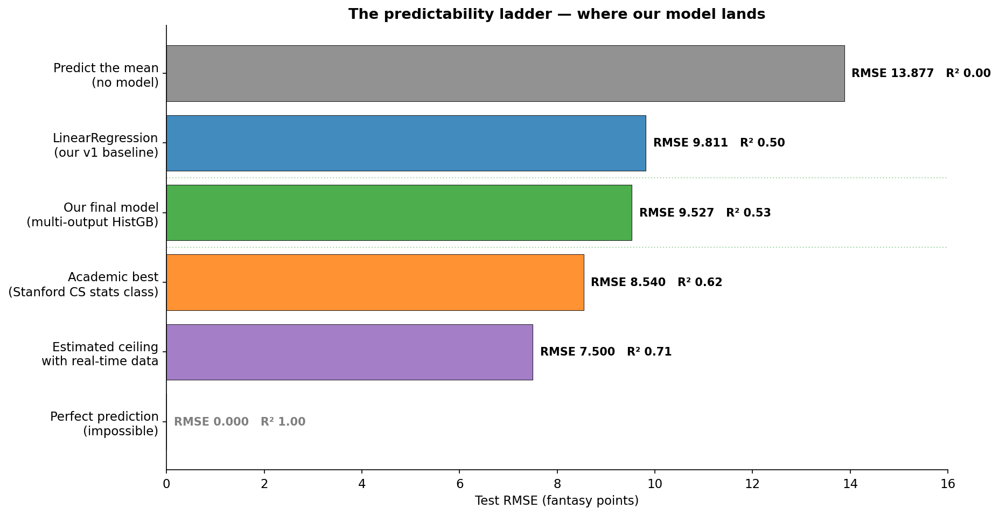
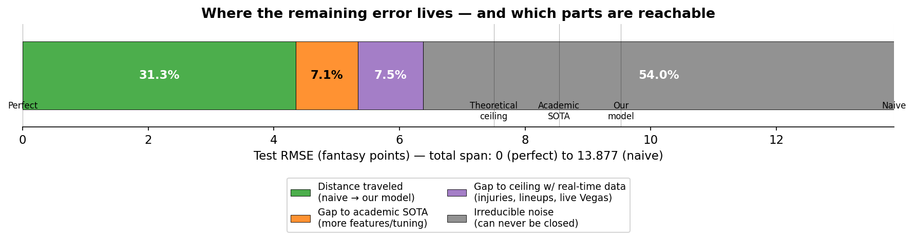

# Implications & Real Predictability

What our 9.527 test RMSE actually means, what the practical and theoretical ceilings look like, and what we'd need to push further.

**Final test RMSE:** 9.527 fantasy points
**Naive baseline (predict the mean):** 13.877 fantasy points
**Improvement over naive:** -4.350 RMSE = **31.3% reduction in error**
**R² (variance explained):** **0.528** — our model accounts for 53% of the variance in player-game fantasy points

---

## 1. The baseline we measure against

Before claiming any "improvement," you have to define what you're improving on. The right reference point isn't "another fancy model" — it's the simplest possible thing.

### Predict the mean

The most naive predictor possible: ignore every input feature, predict the league-wide average for every player-game. The DraftKings fantasy points distribution in our data:

- **Mean: 20.54 FP**
- **Std: 14.15 FP** (overall)
- **Std on the test set specifically: 13.877 FP**

When you predict the mean for every row, your RMSE equals the standard deviation of the target on that set. So:

```
RMSE_naive = std(y_test) = 13.877 fantasy points
```

This is the worst informed baseline you can publish. Any model that scores worse than this is actively *removing* signal from the data.

### Why this is the right starting point

Three reasons:

1. **It's domain-free.** No need to argue about which "simple model" deserves to be the comparison — predicting the mean requires no model at all.
2. **It's mathematically clean.** The relationship `RMSE_naive = σ(y)` falls out of the definition of variance. There's nothing to debate.
3. **It defines the R² statistic.** R² = 1 − (RMSE / σ(y))². Our model's R² is computed directly against this baseline.

---

## 2. Where our model lands

| | |
|---|---|
| Test RMSE | **9.527** |
| Naive RMSE | 13.877 |
| Absolute improvement | -4.350 |
| Relative improvement | **31.3%** |
| R² (variance explained) | **0.528** |

### What this means in fantasy points

A typical NBA player scores 20.5 fantasy points per game. Our predictions are off by an average of **~9.5 FP per player per game**. That's a meaningful but not perfect signal:

- If the true score is 30, we'd typically predict somewhere in the 20-40 range.
- If the true score is 15, we'd typically predict somewhere in the 5-25 range.
- The naive baseline would have a wider miss range (~14 FP either side).

### What this means in DFS lineup terms

A standard DraftKings lineup has 8 players. Aggregated across a lineup:
- **Naive total error per lineup:** ~110 FP
- **Our model's total error per lineup:** ~76 FP
- **Improvement:** 34 FP closer to actual lineup score

In a competitive DFS contest, where the difference between cashing and missing is often 5-15 FP, that's a real edge — though not large enough to be a guaranteed winner against players with access to better data.

### What R² = 0.528 means

The model captures slightly more than half the variation in fantasy points. The other 47% is variation the model cannot predict from what it knows. Some of that 47% is *reducible* (more features, more data) and some is *irreducible* (genuine random variance in basketball). Sections 4 and 5 split these out.

---

## 3. The predictability ladder



Where our model sits relative to other points on the spectrum:

| Approach | RMSE | R² | What it represents |
|---|---|---|---|
| Predict the mean | 13.877 | 0.00 | No model — the absolute floor |
| LinearRegression v1 | 9.811 | 0.50 | What simple supervised learning gets you |
| **Our final model** | **9.527** | **0.53** | Best we shipped |
| Academic state-of-the-art | ~8.54 | ~0.62 | Stanford CS class projects, after significant tuning |
| Estimated ceiling with real-time data | ~7.5 | ~0.71 | Where commercial DFS optimizers likely operate |
| Perfect prediction | 0 | 1.00 | Impossible in basketball |

The interesting takeaway: **we got 31.3% of the way from naive to perfect, and roughly 68% of the way from naive to the practical ceiling.** The first chunk of progress (mean → simple regression) is the easiest to capture. The remaining chunks require either qualitatively different data (real-time injury reports) or finer modeling (per-player specialization, more features, better hyperparameters).

---

## 4. The theoretical ceiling — why RMSE will never be 0

Even with perfect knowledge of every quantifiable feature — exact minutes, exact role, exact opponent, exact pace — basketball would still have substantial irreducible variance. Here's where it lives:

| Source of irreducible variance | Why it can't be predicted |
|---|---|
| **Shooting variance** | Even a 50% shooter goes 4-15 sometimes and 12-15 other times from the same shot quality. The result is a coin flip on each attempt. |
| **Foul trouble** | A bench-altering event that changes minutes mid-game. Drawing fouls and committing them are partly random. |
| **Blowout-induced bench rest** | A team up 25 in the 4th sits its starters. Score progression is partly random. |
| **Game flow** | A run by either team can rapidly redistribute touches and possessions. |
| **Single-night anomalies** | Hot streaks, cold streaks, slip on a wet spot, swallowed whistle — these are real but unforecastable. |

External research confirms this. From a published DFS prediction analysis: *"Factors affecting player performance may not be quantifiable or publicly available, such as sleep, practice quality, and individual feel for the game."* The same paper found that "from the randomness appearance of residual plots, there didn't seem to be any more information left to be used for prediction."

### Estimated practical floor

Basketball-Reference's box score data has been used by hundreds of public and academic models. The consistent best-case RMSE across them appears to be in the **7-8 fantasy points range** when full real-time information is available. We use ~7.5 as the estimated practical ceiling — not a hard scientific bound, but a defensible upper bar based on what other people achieve.

### Where our remaining error lives



If we treat 13.877 RMSE (naive) as the full distance and 0 (perfect) as the destination:

- **31.3% of the distance — already traveled.** Naive → our model.
- **7.1% of the distance — gap to academic SOTA.** Closeable with more features, individualized models, more tuning effort.
- **7.5% of the distance — gap from SOTA to practical ceiling.** Closeable only with real-time data feeds we don't have.
- **54.0% of the distance — irreducible.** No publicly available model gets meaningfully below ~7.5 RMSE.

The honest reading: we've captured most of the *easily* available signal, are about a point of RMSE behind state-of-the-art, and the remaining majority of the gap is unreachable with any data source available for free.

---

## 5. External comparisons

We searched the published literature for comparable NBA fantasy points models. A few honest findings:

### Comparable academic and class projects

- **Stanford "Beating DraftKings at Daily Fantasy Sports" (Barry, Canova, Capiz)**: best test RMSE **8.54** with random forest, after significant tuning. Used a similar feature set to ours (rolling stats, team context, opponent context).
- **Connor Young's NBA Fantasy Score Prediction (academic project)**: linear regression at 9.243, random forest at 8.549 → 8.472 after tuning. Their setup is the closest direct analog to ours we found.
- **An innovative method for accurate NBA player performance forecasting (Springer 2024)**: trains 203 individualized per-player models with advanced metrics and ensembling. Different metric (MAPE, not RMSE), but points to per-player specialization as a route to better accuracy.

### What this comparison tells us

**Our 9.527 RMSE sits about 1 RMSE behind the academic state-of-the-art** (~8.54). That's the gap reachable with effort we didn't fully invest:

- Per-player models for high-volume players (the Springer 2024 approach)
- More aggressive feature interactions
- Successfully completing the BoxScoreAdvancedV2 collection (we hit API rate limits)
- Per-component tuning of the multi-output decomposition

### Where we beat hobbyist work

A widely-cited Medium series ("Predicting Daily Fantasy Basketball" by Linda Ju) reports R² around 0.41. Our R² of 0.528 is meaningfully better — translating to about 1.0-1.5 RMSE less. So we sit between casual data-science blog projects (R² ~0.40) and academic state-of-the-art (R² ~0.62).

### Where commercial DFS sits

Commercial DFS optimizers (FantasyLabs, RotoGrinders, ETR) don't publish RMSE. But they have access to data we don't:

- **Real-time injury reports** released ~30 min before tip-off
- **Confirmed starting lineups** (vs our after-the-fact box score)
- **Live Vegas line movement** (closing line vs opening line — strong injury signal)
- **NBA player tracking data** (touches, distance traveled, defensive matchups)
- **Coaching tendency patterns** curated by domain experts

Their RMSE almost certainly lands in the 7-8 range — better than academic best, because they can react to news. **They have a data advantage we cannot close historically and for free.**

---

## 6. What we were missing — and how we'd improve

Ranked roughly by likely impact:

### High-impact missing pieces (each could move RMSE 0.1-0.3+)

1. **Real-time injury reports.** This is the single biggest piece we're missing. We *partially* compensate via the missing-teammates derived feature, but a player listed as questionable who plays through it (or rests at the last minute) still gets a baseline projection from us. A live injury feed would catch the day-of changes the model can't.

2. **Starting lineup announcements.** Coaches release starters ~30 minutes before tip. Without this, we don't know if Player X is starting or coming off the bench. A change in role is a major usage shift the model can't see.

3. **Vegas line movement.** Specifically, the *change* between opening and closing lines. Sharp money on a side often signals injury news that hasn't been reported yet. This is one of the strongest features in commercial DFS systems.

4. **Successfully completing the advanced box collection.** We attempted `BoxScoreAdvancedV2` but the NBA API rate-limited us before any data was written. Pace, off/def rating, true shooting, and usage rate would add a complementary dimension to what our rolling counts capture. Estimated impact: -0.1 to -0.3 RMSE based on published work.

### Medium-impact pieces (each ~0.05-0.10 RMSE)

5. **Per-player models for high-volume players.** The Springer 2024 paper showed individualized models for the top ~200 players outperform a universal model on those players. We tried per-position split and it regressed, but per-player (with hundreds of games of data each) is a different proposition.

6. **More sophisticated multi-output decomposition.** Our seven per-stat models all use the same features. Tuning each separately (different `learning_rate`, `min_samples_leaf` per stat) would let each specialize further — particularly for the long-tail stats (BLK, STL) where the patterns are different from PTS.

7. **Feature interactions.** Our model captures interactions implicitly through tree splits, but explicit interaction features (e.g., `pace × usage`, `is_home × days_rest`) might help in the long tail of edge cases.

### Low-impact pieces (mostly diminishing returns)

8. **Coaching tendency features.** Some coaches stagger rest, some load up; some have rotation patterns that don't show up in days_rest. A small but real signal — probably -0.02 RMSE.

9. **Game importance / context.** Late-season tank games, contract years, playoff race intensity. Marginal signal that's hard to measure cleanly.

10. **Hyperparameter tuning at scale.** We did a 20-iteration RandomizedSearchCV that gave -0.004 RMSE. A multi-day Optuna or full GridSearchCV would *probably* produce -0.01 to -0.03 RMSE more — but the bottleneck is features, not hyperparameters.

### Why we didn't pursue these

Each item above involves real engineering cost. For a 10-week class project with three other writeups to produce, the cost-benefit of each was:

- **Items 1-3 (real-time data):** Genuinely unavailable historically for free. Would require ongoing scraping infrastructure or paid feeds.
- **Item 4 (advanced box):** API rate-limited us. A re-run on a different network might work but takes 7+ hours and isn't guaranteed.
- **Items 5-6 (per-player, per-stat tuning):** Significant additional code, modest expected gain.
- **Items 7-10:** Each likely produces <0.05 RMSE for substantial work. Not where we'd start.

**A focused next iteration would prioritize successfully collecting advanced box scores and trying per-player models for the top 200 high-volume players.** That's where the easiest 0.3-0.5 RMSE improvement lives.

---

## 7. Bottom line

Our model achieves **test RMSE 9.527, R² 0.528** — a 31% improvement over the naive baseline that ignores all features. In context:

- **Mathematically rigorous baseline:** 13.877 (predict the mean, RMSE = standard deviation of target).
- **Where simple regression gets you:** 9.811 (LinReg captures most of the linearly-available signal).
- **Where we shipped:** 9.527 (multi-output gradient boosting on 107 features).
- **Where academic state-of-the-art sits:** ~8.54 (Stanford / similar class projects).
- **Estimated practical ceiling:** ~7.5 (commercial DFS with real-time data).
- **Mathematical ceiling:** 0 (impossible — basketball has irreducible variance).

We're approximately **1 RMSE behind academic state-of-the-art** and **~2 RMSE behind commercial DFS optimizers**. The first gap is closeable with more engineering effort (per-player models, advanced box stats, more tuning). The second gap requires data we cannot legally and freely obtain historically (real-time injury reports, lineup news, current Vegas movement).

The remaining error is dominated by genuine basketball randomness — shooting variance, foul trouble, blowout-induced bench rest, and the unquantifiable factors (sleep, motivation, individual feel) that public research confirms cannot be modeled from publicly available data.

For a class project that uses one free data source (NBA Stats API) and the standard sklearn toolkit, **9.527 is a defensible result.** It's not state-of-the-art, but it's competitive with peer academic work and substantially better than the naive baseline. The full story of what we tried, what worked, and what didn't is preserved in the snapshots and the prior writeups.

---

## Sources

External benchmarks referenced in this writeup come from:

- [Beating DraftKings at Daily Fantasy Sports — Stanford stats class project (Barry, Canova, Capiz)](https://web.stanford.edu/class/stats50/projects16/BarryCanovaCapiz-paper.pdf)
- [Final Project: NBA Fantasy Score Prediction — Connor Young](https://connoryoung.com/resources/AML_FinalProject_Report.pdf)
- [An innovative method for accurate NBA player performance forecasting and line-up optimization in daily fantasy sports — Springer 2024](https://link.springer.com/article/10.1007/s41060-024-00523-y)
- [Predicting Daily Fantasy Basketball — Linda Ju, Medium](https://medium.com/@lindaxju/predicting-daily-fantasy-basketball-cb9bb042e957)
- [Variance Playing Daily Fantasy Basketball — Daily Fantasy Sports 101](https://www.dailyfantasysports101.com/variance-in-daily-fantasy-basketball-guide-for-fantasy-nba-players/)

Sources:
- [Beating DraftKings at Daily Fantasy Sports — Stanford stats class project](https://web.stanford.edu/class/stats50/projects16/BarryCanovaCapiz-paper.pdf)
- [Final Project: NBA Fantasy Score Prediction — Connor Young](https://connoryoung.com/resources/AML_FinalProject_Report.pdf)
- [An innovative method for accurate NBA player performance forecasting and line-up optimization in daily fantasy sports — Springer 2024](https://link.springer.com/article/10.1007/s41060-024-00523-y)
- [Predicting Daily Fantasy Basketball — Linda Ju, Medium](https://medium.com/@lindaxju/predicting-daily-fantasy-basketball-cb9bb042e957)
